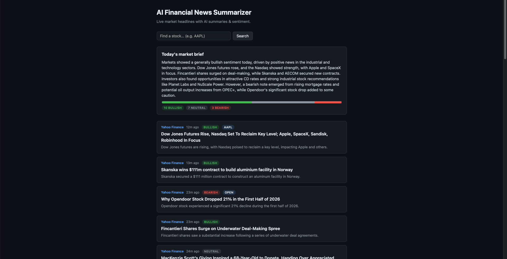

# AI Financial News Summarizer



Aggregates financial news and summarizes market-moving events with AI-powered
sentiment analysis.

**Live demo:** [ai-financial-news-3i44.vercel.app](https://ai-financial-news-3i44.vercel.app)

**Stack:** Next.js · OpenAI SDK (pointed at Google Gemini's free API) · PostgreSQL (Neon free tier) · Vercel cron

## Roadmap

- [x] **Phase 1 — News feed.** Fetch headlines from free RSS feeds (CNBC
      Markets/Economy, Yahoo Finance, MarketWatch) and display them.
      Parser logic unit-tested (`npm test`).
- [x] **Phase 2 — AI summaries + sentiment.** One batched LLM call per feed
      refresh returns a 1-line summary, bullish/bearish/neutral label, and
      affected tickers per story. OpenAI SDK pointed at Google Gemini's free
      OpenAI-compatible endpoint ($0). In-memory cache keeps the request path
      from hammering the free-tier rate limit.
- [x] **Phase 3 — PostgreSQL.** Articles + analysis stored in Neon (free
      Postgres). Page checks the DB first and only sends *unseen* stories to
      the AI — analysis is paid for once, ever, per article. Falls back
      gracefully when DATABASE_URL is unset.
- [x] **Phase 4 — Daily market brief.** One AI-generated "what moved markets
      today" digest built from the last 24h of stored analysis, a
      bullish/bearish/neutral ratio bar, and a click-to-filter-by-ticker view
      (`?ticker=AAPL`).
- [x] **Phase 5 — Deploy.** Live on Vercel:
      **[ai-financial-news-3i44.vercel.app](https://ai-financial-news-3i44.vercel.app)**.
      A weekday cron (22:00 UTC, after US market close) hits `/api/refresh` to
      fetch + analyze new stories automatically; the route is protected by a
      `CRON_SECRET` bearer token so strangers can't burn the AI quota.

## Run locally

1. Install [Node.js LTS](https://nodejs.org) (check with `node -v`).
2. In this folder:

   ```bash
   npm install
   npm run dev
   ```

3. Open http://localhost:3000

## How it works

```
RSS feeds (4, parallel)                    lib/news.js
   → normalize → dedupe → cap per source → sort
   → check Postgres: which links already analyzed?   lib/db.js
   → batch UNSEEN stories into ONE Gemini call       lib/ai.js
   → save fresh analysis to Postgres
   → render cards with sentiment + ticker tags       app/page.js
```

- `lib/news.js` — downloads 4 RSS feeds in parallel, merges, dedupes, caps
  per-source flooding, sorts newest-first. Pure logic split from I/O for tests.
- `lib/ai.js` — one batched call for all unseen headlines (free tier limits
  requests/minute). Defensive JSON parsing: bad reply → page renders without
  tags, never crashes. In-memory cache guards the rate limit in dev.
- `lib/db.js` — Neon Postgres. `articles` table keyed by link (UNIQUE).
  **Analysis is never paid for twice** — the DB is checked before the AI.
- `app/page.js` — React **server component**: all of the above runs
  server-side, browser gets finished HTML. `revalidate = 300` = 5-min cache.

## Environment (.env.local)

| Variable | Where to get it | Without it |
|---|---|---|
| `GEMINI_API_KEY` | [aistudio.google.com/apikey](https://aistudio.google.com/apikey) (free) | headlines render plain, no AI tags |
| `DATABASE_URL` | [neon.tech](https://neon.tech) → project → Connection string (free) | AI re-analyzes on cache expiry, nothing persists |

## Tests

```bash
npm test        # 27 tests: parser, AI response handling, DB merge logic
```
