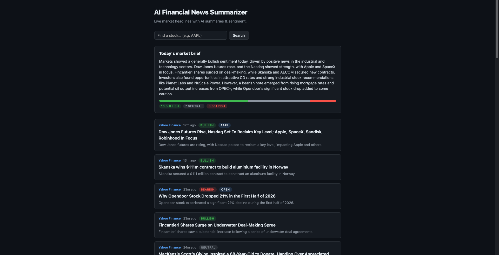

# AI Financial News Summarizer

[](https://github.com/alexislowys/ai-financial-news/actions/workflows/ci.yml)



Aggregates financial news and summarizes market-moving events with AI-powered
sentiment analysis.

**Live demo:** [ai-financial-news-3i44.vercel.app](https://ai-financial-news-3i44.vercel.app)

**Stack:** Next.js · OpenAI SDK (pointed at Google Gemini's free API) · PostgreSQL (Neon free tier) · Vercel cron

## Why I built it

I'm a data science student, and I wanted a project that touched a real
production stack end to end — not another notebook. This app forced me through
the whole lifecycle: parsing messy real-world feeds, batching LLM calls to
survive free-tier rate limits, designing a database layer so analysis is paid
for once instead of on every page load, and debugging a deployment that worked
locally but failed in CI (a dependency installed one directory too high —
lesson learned about `node_modules` resolution). The most interesting
constraint was cost: every design decision — caching, batching, analyze-once
persistence — exists because the AI budget was $0.

## Roadmap

- [x] **Phase 1 — News feed.** Fetch headlines from free RSS feeds (CNBC
      Markets/Economy, Yahoo Finance, MarketWatch) and display them.
      Parser logic unit-tested (`npm test`).
- [x] **Phase 2 — AI summaries + sentiment.** One batched LLM call per feed
      refresh returns a 1-line summary, bullish/bearish/neutral label, and
      affected tickers per story. OpenAI SDK pointed at Google Gemini's free
      OpenAI-compatible endpoint ($0). In-memory cache keeps the request path
      from hammering the free-tier rate limit.
- [x] **Phase 3 — PostgreSQL.** Articles + analysis stored in Neon (free
      Postgres). Page checks the DB first and only sends *unseen* stories to
      the AI — analysis is paid for once, ever, per article. Falls back
      gracefully when DATABASE_URL is unset.
- [x] **Phase 4 — Daily market brief.** One AI-generated "what moved markets
      today" digest built from the last 24h of stored analysis, a
      bullish/bearish/neutral ratio bar, and per-ticker pages at
      `/stock/AAPL`.
- [x] **Phase 5 — Deploy.** Live on Vercel:
      **[ai-financial-news-3i44.vercel.app](https://ai-financial-news-3i44.vercel.app)**.
      A weekday cron (22:00 UTC, after US market close) hits `/api/refresh` to
      fetch + analyze new stories automatically; the route is protected by a
      `CRON_SECRET` bearer token so strangers can't burn the AI quota.

## Security

The app consumes third-party RSS text and feeds it to an LLM whose output is
then stored and rendered, so untrusted input is the central design concern.

| Threat | Mitigation |
|---|---|
| **Prompt injection** — a crafted headline instructing the model to change its output | Headline text is length-capped, stripped of angle brackets, wrapped in a delimited `<stories>` block, and preceded by an explicit instruction that the block is data, not commands |
| **Hostile model output** — injected "tickers" like `../../../etc/passwd` or 500-character strings reaching the database and `href` attributes | Every ticker must match `^[A-Z][A-Z.\-]{0,5}$`; summaries are truncated; sentiment is coerced to a fixed enum. Covered by regression tests |
| **SQL injection** | All queries are parameterized via `@neondatabase/serverless` tagged templates; the ticker route additionally validates input before querying |
| **Quota / cost abuse** — anonymous traffic driving paid LLM calls and upstream fetches | The home page takes no search params, so it stays statically cached (5 min revalidate) instead of re-running RSS fetches per request; analysis is deduplicated against the database; LLM replies are token-capped |
| **Unauthenticated refresh** | `/api/refresh` **fails closed** — a missing `CRON_SECRET` returns 503 in production rather than silently disabling the check — and compares the bearer token in constant time |
| **XSS / clickjacking** | React escapes all interpolated values; CSP (`frame-ancestors 'none'`, `object-src 'none'`, `form-action 'self'`), `X-Frame-Options`, `nosniff`, and HSTS are set in `next.config.js` |
| **Secret exposure** | Secrets live only in `.env.local` (git-ignored) and Vercel environment variables; nothing secret is committed or sent to the client |

**Dependency posture:** `npm audit --omit=dev` is clean as of Next 16.3.5.
CI audits production dependencies at `--audit-level=critical` on every push,
so a newly disclosed critical fails the build rather than lingering silently.

## Accessibility

Keyboard-focusable controls have visible `:focus-visible` rings, the search
input has a screen-reader label, the sentiment bar exposes its counts via
`aria-label` rather than relying on color alone, and all text meets WCAG AA
contrast (verified by measuring composited values — the bearish tag failed at
4.35:1 and was corrected to 5.79:1).

## Run locally

1. Install [Node.js LTS](https://nodejs.org) (check with `node -v`).
2. In this folder:

   ```bash
   npm install
   npm run dev
   ```

3. Open http://localhost:3000

## How it works

```
RSS feeds (4, parallel)                    lib/news.js
   → normalize → dedupe → cap per source → sort
   → check Postgres: which links already analyzed?   lib/db.js
   → batch UNSEEN stories into ONE Gemini call       lib/ai.js
   → save fresh analysis to Postgres
   → render cards with sentiment + ticker tags       app/page.js
```

- `lib/news.js` — downloads 4 RSS feeds in parallel, merges, dedupes, caps
  per-source flooding, sorts newest-first. Pure logic split from I/O for tests.
- `lib/ai.js` — one batched call for all unseen headlines (free tier limits
  requests/minute). Defensive JSON parsing: bad reply → page renders without
  tags, never crashes. In-memory cache guards the rate limit in dev.
- `lib/db.js` — Neon Postgres. `articles` table keyed by link (UNIQUE).
  **Analysis is never paid for twice** — the DB is checked before the AI.
- `app/page.js` — React **server component**: all of the above runs
  server-side, browser gets finished HTML. `revalidate = 300` = 5-min cache.

## Environment (.env.local)

| Variable | Where to get it | Without it |
|---|---|---|
| `GEMINI_API_KEY` | [aistudio.google.com/apikey](https://aistudio.google.com/apikey) (free) | headlines render plain, no AI tags |
| `DATABASE_URL` | [neon.tech](https://neon.tech) → project → Connection string (free) | AI re-analyzes on cache expiry, nothing persists |

## Tests

```bash
npm test        # 41 tests: feed parsing, AI response handling, prompt-injection
                # defenses, ticker validation, and DB merge logic
```

Every push runs the suite, a clean `npm ci` install, a production build with no
secrets present (proving the app degrades gracefully rather than crashing), and
a dependency audit — see [`.github/workflows/ci.yml`](.github/workflows/ci.yml).
